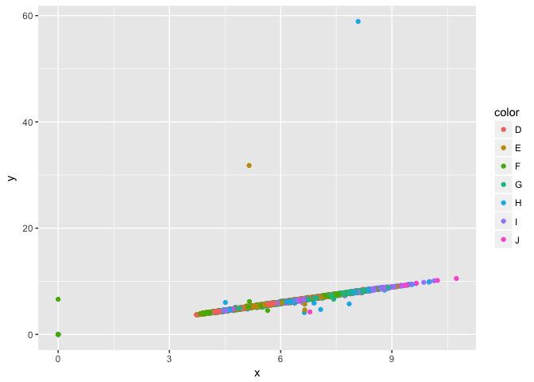

Test notebook output
================

This is an [R Markdown](http://rmarkdown.rstudio.com) Notebook, meant to test how github displays html generated from R Notebooks.

Displaying plots
================

Here's a plot.

``` r
library(ggplot2)
ggplot(diamonds, aes(x=x,y=y, colour=color)) + 
  geom_point()
```



Displaying in-line code
=======================

Here's some text, including inline code which should be the number four: `2+2`.

Displaying data frames
======================

Here's a data frame:

``` r
head(diamonds)
```

    ## # A tibble: 6 × 10
    ##   carat       cut color clarity depth table price     x     y     z
    ##   <dbl>     <ord> <ord>   <ord> <dbl> <dbl> <int> <dbl> <dbl> <dbl>
    ## 1  0.23     Ideal     E     SI2  61.5    55   326  3.95  3.98  2.43
    ## 2  0.21   Premium     E     SI1  59.8    61   326  3.89  3.84  2.31
    ## 3  0.23      Good     E     VS1  56.9    65   327  4.05  4.07  2.31
    ## 4  0.29   Premium     I     VS2  62.4    58   334  4.20  4.23  2.63
    ## 5  0.31      Good     J     SI2  63.3    58   335  4.34  4.35  2.75
    ## 6  0.24 Very Good     J    VVS2  62.8    57   336  3.94  3.96  2.48
