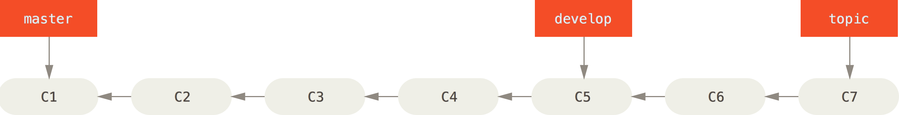

This lecture borrows heavily from [Chacon (2014) Pro Git](https://git-scm.com/book/en/v2), which is also the source of the figures except as noted. 

# Version control: Why
* 
* Collaboration: like Word's 'track changes' for code (or anything else)
* *Unlike* Word's 'track changes', easily roll back to any former state. 
    * Particularly useful for code, where a change can break your code in ways that can be tough to understand
* git + github: easy remote backup for your project
* issue tracking tool built into github is handy for fixing bugs as well as organizing work that needs to be done

# Git: What
* A set of files and directories under version control is called repository or *repo* - must all be within the same master directory
* Based on 'commits'
* 'Snapshots' of the state of your 
* All this information lives in the `.git` directory - this is the actual repo

# Git: How

## Setting up

* This is highly platform-specific: Follow the instructions in [Chacon Ch. 1.5](https://git-scm.com/book/en/v2/Getting-Started-Installing-Git).

## Useful commands
* The [three states](https://git-scm.com/book/en/v2/Git-Basics-Recording-Changes-to-the-Repository): Working directory, staging area, and git repository:

    * `git add`: move files in the working directory to the staging area: `git add myscript.R`. This means *add to the next commit* not *add to the project*.
    * `git commit`: move files from the staging area to the repo: `git commit -m "corrected normalization procedure"`
* Check the state and history of your repo:
    *  `git status`
    *  `git log`
* Working with remotes:
    * `clone`: get a total local copy of a remote repo (generally do it just once at the start of a project)
    * `fetch`: get any data from remote project that you don't yet have\
    * `pull`: get any data from remote project and also merge it to the specified branch
    * `push`: send the specified branch to the remote, e.g. `git push origin master`
* Branching
    * `git branch [branchname]`: create new branch [branchname]. 
    * `get checkout [branchname]`: moves **HEAD** to point to [branchname]. **Note what this does to the files you see in your file browser!**
    * ` git merge [branchname]`: merge changes from [branchname] into current branch (wherever HEAD is pointing)

## A very simple workflow

(Images are Fig 26 and 27 from Chacon Chapter 3.4)

