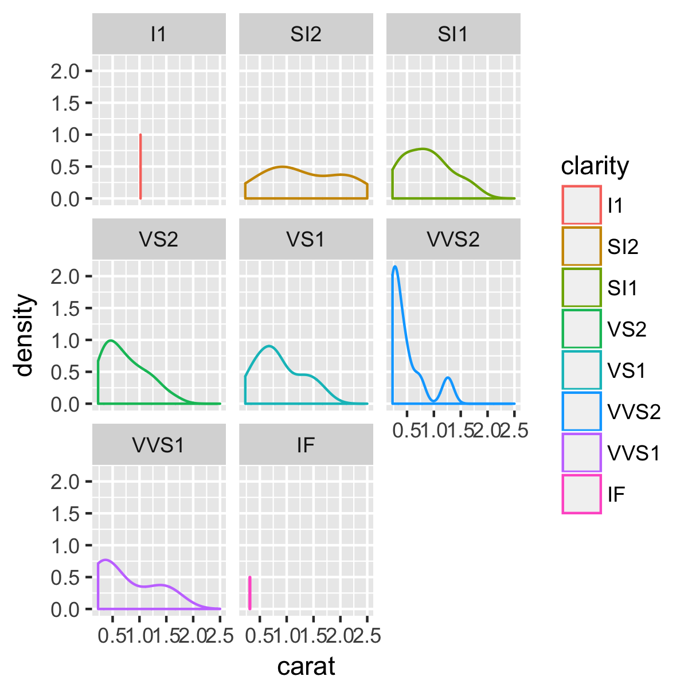
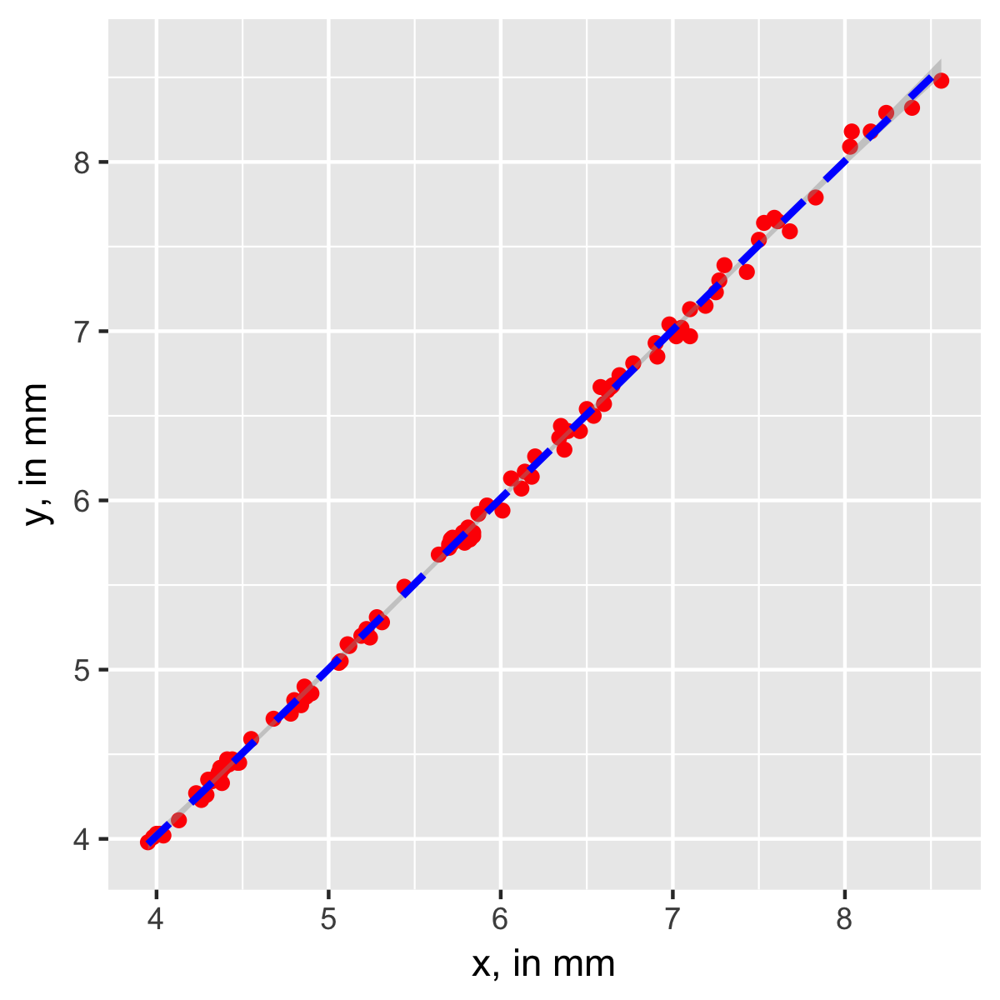

# Required reading
* Tufte, The Visual Display of Quantitative Information, Ch 4-6 (on Canvas)

# Recommended reading
* Tufte on Powerpoint (on Canvas)

# Resources
* [Getting started with ggplot2](https://rpubs.com/hadley/ggplot-intro) by Hadley Wickham
* [Cookbook for R](http://www.cookbook-r.com/Graphs/) Graphs chapter
* Many more web resources on **ggplot2:** google will help you. 

**Note:** some web resources (including the Wickham ggplot2 book) encourage using ggplot2's `qplot` syntax, which is simpler (but, in my mind, more confusing) than the standard syntax. I encourage you to ignore this syntax; in my opinion it just makes it more difficult to understand **ggplot2**.

# Tasks
* Find a plot in a published paper or scientific book. Evaluate it based on the principles Tufte lays out in the required reading.
* **Create a single, well-commented script** (or R Notebook, if you know how to do that) that does the following
* Determine how many rows the `diamonds` data set that comes loaded with **ggplot2** has
* Use the following code to create a reproducible subset of `diamonds`. *Explain each line of the code in words*.
```
set.seed(1410)
dsmall <- diamonds[sample(nrow(diamonds), 100), ]
```
* Use `dsmall` to create the following plots:
    * 
    * 
    * 
    * 
    * 
* Make the worst plot you possibly can in ggplot2. This plot should be awful in two independent respects:
    *  It should represent the data misleadingly (this can sometimes be difficult with ggplot2, but be creative)
    *  It should be as ugly as possible. (`theme` will be helpful here.)


